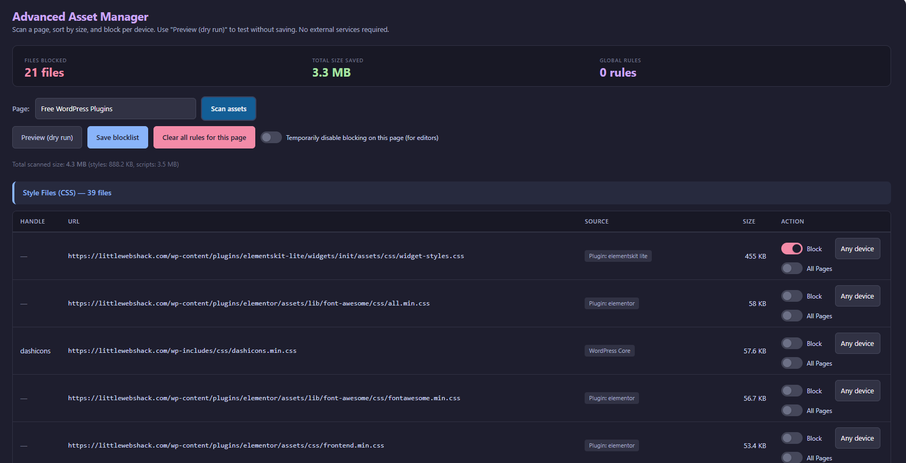

# MBR Advanced Asset Manager

[](https://wordpress.org/)
[](https://php.net/)
[](https://www.gnu.org/licenses/gpl-3.0.html)
[](https://github.com/yourusername/mbr-advanced-asset-manager)
[](https://github.com/yourusername/mbr-advanced-asset-manager/releases)



A powerful WordPress plugin that helps you optimize page load times by selectively blocking unnecessary CSS and JavaScript files on specific pages. Completely standalone with no external dependencies!

## 🚀 Key Features

- **✅ 100% Local** - No external APIs, everything runs on your WordPress installation
- **📊 Asset Analysis** - See file sizes to identify optimization opportunities
- **📱 Device-Specific Blocking** - Block assets for mobile, desktop, or both
- **🔍 Preview Mode** - Test blocking rules safely before applying them
- **🎯 Page-Specific Control** - Fine-grained blocking per page
- **🔧 Easy Interface** - Simple admin UI to scan, select, and block assets
- **🏗️ Page Builder Compatible** - Works seamlessly with Elementor, Divi, Beaver Builder, and more
- **⚡ Performance Focus** - Reduce page size by 1-3MB and improve load times by 20-40%

## 📦 What's New in Version 2.0.0

**Major Update: Completely Standalone!**

- ❌ **Removed** browserless.io dependency
- ❌ **Removed** external API requirements
- ✅ **Added** fully local scanning using WordPress native functions
- ✅ **Improved** error messages with troubleshooting guidance
- ✅ **Enhanced** privacy - no data leaves your server

## 📋 Requirements

- WordPress 5.8 or higher
- PHP 7.4 or higher
- Ability to make loopback HTTP requests (standard on most hosts)

## 🔧 Installation

### Standard Installation

1. Download the latest release ZIP file
2. Navigate to **WordPress Admin → Plugins → Add New**
3. Click **Upload Plugin** and select the ZIP file
4. Click **Install Now** and then **Activate**
5. Go to **Settings → Advanced Asset Manager** to start optimizing

### Manual Installation

1. Extract the ZIP file
2. Upload the `mbr-advanced-asset-manager` folder to `/wp-content/plugins/`
3. Activate the plugin through the WordPress admin panel

### WP-CLI Installation

```bash
wp plugin install mbr-advanced-asset-manager.zip --activate
```

### Optional: Enhanced Blocking (MU-Plugin)

For maximum blocking effectiveness:

1. Copy `asm-blocker.php` from the plugin folder to `/wp-content/mu-plugins/`
2. Create the `mu-plugins` folder if it doesn't exist
3. This enables additional client-side blocking for stubborn assets

## 📖 Usage

### Quick Start Guide

1. **Access the plugin**: Go to **Settings → Advanced Asset Manager**
2. **Select a page**: Choose from the dropdown menu
3. **Scan assets**: Click "Scan assets" to analyze the page
4. **Review results**: See all CSS/JS files sorted by size
5. **Select assets**: Check boxes for files you want to block
6. **Choose devices**: Select mobile, desktop, or both for each asset
7. **Preview first**: Click "Preview (dry run)" to test safely
8. **Save blocklist**: Once tested, click "Save blocklist" to apply

### Understanding the Results

The scan shows:
- **Handle** - WordPress's internal name for the asset
- **URL** - Full path to the CSS/JS file
- **Source** - Origin (Plugin, Theme, Core, External)
- **Size** - File size (focus on largest files first)
- **Action** - Checkbox and device selector

### Device-Specific Blocking Examples

```
Scenario: Mobile menu script not needed on desktop
→ Block on Desktop only

Scenario: Heavy parallax effects disabled on mobile
→ Block on Mobile only

Scenario: Unused contact form CSS
→ Block on Any device
```

## 🎯 How It Works

The plugin uses a completely local scanning approach:

1. **Loopback Scanning** - Makes HTTP request to your own site using `wp_remote_get()`
2. **Asset Detection** - Parses HTML to find all CSS and JS files
3. **Handle Resolution** - Matches assets to WordPress enqueue handles
4. **Size Detection** - Determines file sizes via HEAD requests
5. **Local Storage** - Saves rules in post meta (no external database)
6. **Runtime Blocking** - Dequeues assets on frontend based on saved rules

## 🛡️ Page Builder Compatibility

Automatically detects and skips blocking when editing in:

- ✅ Elementor
- ✅ Beaver Builder
- ✅ Divi Builder
- ✅ Visual Composer
- ✅ Oxygen Builder
- ✅ Bricks Builder
- ✅ Other common page builders

Assets are only blocked on the public-facing site, never in editor mode!

## 💡 Best Practices

### DO:
- ✅ Always use preview mode before saving
- ✅ Start with the largest files
- ✅ Test thoroughly after blocking
- ✅ Optimize page by page
- ✅ Clear all caches after changes

### DON'T:
- ❌ Block everything at once without testing
- ❌ Skip preview mode
- ❌ Block core WordPress files
- ❌ Block assets you don't recognize (test first)

### High-Impact Targets

Block these types of files first for maximum performance gains:

- Unused Google Fonts
- Slider plugins on pages without sliders
- Gallery plugins on pages without galleries
- Contact form CSS when no form is present
- Duplicate functionality (multiple lightboxes, etc.)
- Social sharing scripts you don't use

## 🔧 Troubleshooting

### Scan Failed or Connection Errors

**Common Causes:**
- Security plugin blocking loopback requests
- Server firewall restrictions
- Site under maintenance mode
- SSL certificate issues

**Solutions:**
1. Temporarily disable security plugins (Wordfence, Sucuri)
2. Check server firewall settings
3. Verify site loads normally in browser
4. Contact hosting provider about loopback requests

### Access Denied (403) Error

**Solutions:**
- Whitelist WordPress admin IP in security plugin
- Temporarily disable firewall rules
- Check .htaccess restrictions
- Contact host to whitelist loopback requests

### Assets Not Being Blocked

**Checklist:**
1. Did you click "Save blocklist"? (Preview doesn't save)
2. Clear all caches (plugin, server, CDN)
3. Test in incognito/private browsing
4. Verify "disable blocking for editors" is off
5. Ensure you're not in page builder edit mode

## 📊 Typical Performance Gains

| Site Type | Blocked Assets | Size Saved | Speed Improvement |
|-----------|----------------|------------|-------------------|
| Basic Blog | 10-15 files | 500KB - 1MB | 20-30% faster |
| Business Site | 20-30 files | 1-2MB | 30-40% faster |
| E-commerce | 30-50 files | 2-3MB | 40-50% faster |
| Complex Sites | 50+ files | 3-5MB+ | 50%+ faster |

## 🔒 Privacy & Security

- **No External APIs** - All processing happens locally
- **No Data Collection** - We don't track or collect anything
- **No Analytics** - No usage tracking
- **No Cookies** - Except temporary preview cookie
- **Open Source** - Full transparency

## 📝 Technical Details

**Data Storage:**
- Blocking rules: `_mbr_asm_blocklist_v1` post meta
- Disable flag: `_mbr_asm_disable` post meta
- Preview data: Browser cookies (temporary)

**Performance Impact:**
- Admin scanning: One-time HTTP request per scan
- Frontend blocking: Minimal overhead (WordPress hooks only)
- No additional database queries

## 🤝 Contributing

Contributions are welcome! Please feel free to submit a Pull Request.

1. Fork the repository
2. Create your feature branch (`git checkout -b feature/AmazingFeature`)
3. Commit your changes (`git commit -m 'Add some AmazingFeature'`)
4. Push to the branch (`git push origin feature/AmazingFeature`)
5. Open a Pull Request

## 📜 Changelog

### [2.3.0] - 2025-02-13
- Minor bug fixes

### [2.0.0] - 2024-11-27
**MAJOR UPDATE: No External Dependencies**
- Removed browserless.io API integration
- Added fully local scanning using WordPress `wp_remote_get()`
- Improved error messages with troubleshooting guidance
- Enhanced loopback scanning with proper headers
- Increased timeout from 25s to 30s
- Updated admin descriptions
- All data processing now happens locally

### [1.2.4] - Previous
- Initial public release with browserless.io integration

## 📄 License

This plugin is licensed under the GPLv3 or later. See [LICENSE](LICENSE) file for details.

## 👨‍💻 Author

**Robert Palmer**
- Website: [Made by Robert](https://madebyrobert.co.uk)
- Plugin Site: [Little Web Shack](https://littlewebshack.com)
- Email: rob@littlewebshack.com

## 🙏 Support

- **Bug Reports**: [Open an issue](https://github.com/yourusername/mbr-advanced-asset-manager/issues)
- **Feature Requests**: [Open an issue](https://github.com/yourusername/mbr-advanced-asset-manager/issues)
- **Email Support**: rob@littlewebshack.com

## ⭐ Show Your Support

If this plugin helps optimize your WordPress site, please consider:
- Starring this repository ⭐
- Sharing it with others
- Contributing improvements
- Providing feedback

---

**Made with ❤️ by Robert Palmer | Free & Open Source WordPress Tools**
