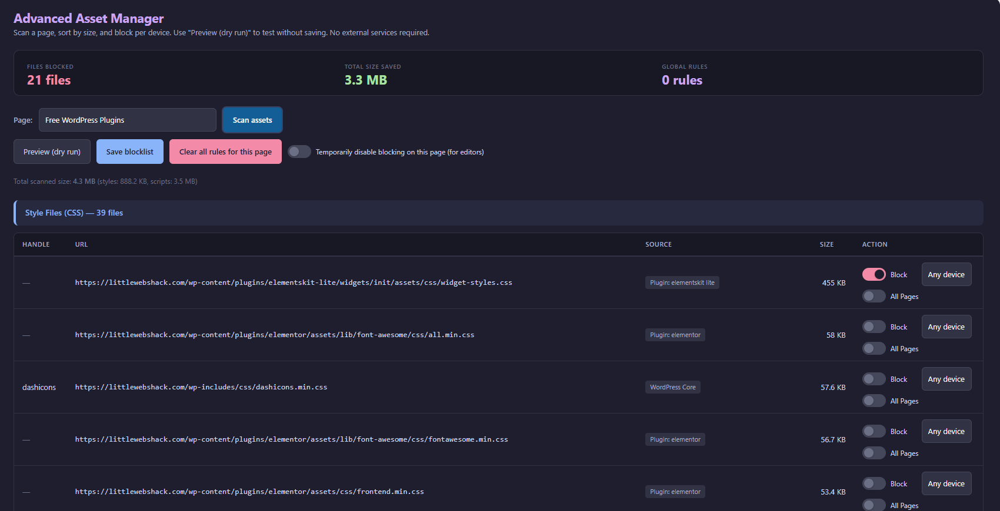

# MBR Advanced Asset Manager

[](https://wordpress.org/)
[](https://php.net/)
[](https://www.gnu.org/licenses/gpl-3.0.html)
[](https://github.com/harbourbob/mbr-advanced-asset-manager)
[](https://github.com/harbourbob/mbr-advanced-asset-manager/releases)
[](https://madebyrobert.co.uk)
[](https://buymeacoffee.com/robertpalmer/)



A powerful WordPress plugin that helps you optimise page load times by selectively blocking unnecessary CSS and JavaScript files on any page, post, or custom post type. Features a dark-mode admin UI with per-page and global blocking controls. Completely standalone with no external dependencies.

[**Download Latest Release**](https://github.com/harbourbob/mbr-advanced-asset-manager/releases) · [**Report a Bug**](https://github.com/harbourbob/mbr-advanced-asset-manager/issues) · [**Request a Feature**](https://github.com/harbourbob/mbr-advanced-asset-manager/issues)

---

## Key Features

- **100% Local** — No external APIs, everything runs on your WordPress installation
- **Asset Analysis** — See file sizes to identify optimisation opportunities
- **Device-Specific Blocking** — Block assets for mobile, desktop, or both
- **Block on All Pages** — Toggle any asset to be blocked globally across your entire site
- **All Post Types** — Manage assets on pages, posts, WooCommerce products, or any public custom post type
- **Preview Mode** — Test blocking rules safely before applying them
- **Dark Mode UI** — Stylish dark admin interface with toggle switches and colour-coded controls
- **Page Builder Compatible** — Works seamlessly with Elementor, Divi, Beaver Builder, and more
- **Performance Focus** — Reduce page size by 1–3MB and improve load times by 20–40%

---

## What's New

### Version 2.5.1 – 2.5.3 — Scan & Blocking Reliability

A patch series fixing three related issues in the scan-and-block workflow:

- **2.5.3** — Rescanning a page no longer hides items already on the saved blocklist. Token-based scan recognition replaces the auth-dependent check that broke in 2.5.1, and tightens scan-parameter security as a side effect (`?mbr_asm_scan=1` can no longer be used to trivially bypass blocking on a page view).
- **2.5.2** — Saved blocklists now block reliably for anonymous visitors, not just in preview. The client-side blocker runs for every blocked item and loads in `<head>` before scripts execute, providing a safety net against cached HTML, direct `<script src="...">` echoes, and late-injected assets.
- **2.5.1** — Scans no longer include admin-bar assets (`dashicons`, `admin-bar.css`, `admin-bar.js`) that real visitors never load. The loopback now fetches the page anonymously rather than forwarding admin login cookies.

**Important when updating to 2.5.3**: If you've installed `asm-blocker.php` to `wp-content/mu-plugins/`, you must re-copy it after upgrading. See the MU-plugin section below.

### Version 2.5.0 — Posts, CPTs & UI Polish

- Support for Posts and all public Custom Post Types (not just Pages)
- Dropdown groups items by post type using optgroups (Pages, Posts, Products, etc.)
- Fixed page refresh after save — scan results are preserved
- Improved dropdown text readability on dark theme

### Version 2.4.0 — Global Blocking & Dark Mode

- **Block on All Pages** — toggle any asset to be blocked globally across every page on your site
- **Dark Mode UI** — Catppuccin Mocha colour palette with stylish toggle switches replacing checkboxes
- **Colour-coded toggles** — red for block, purple for global, blue for settings
- MU-Plugin blocker updated to merge global blocklist with per-page rules
- Global blocking works on non-singular pages (archives, 404, etc.)

### Version 2.0.0 — Completely Standalone

- Removed browserless.io dependency entirely
- Fully local scanning using WordPress native functions
- No data leaves your server

---

## Requirements

- WordPress 5.8 or higher
- PHP 7.4 or higher
- Ability to make loopback HTTP requests (standard on most hosts)

---

## Installation

### Standard Installation

1. Download the latest release ZIP file
2. Navigate to **WordPress Admin → Plugins → Add New**
3. Click **Upload Plugin** and select the ZIP file
4. Click **Install Now** and then **Activate**
5. Go to **Settings → Advanced Asset Manager** to start optimising

### Manual Installation

1. Extract the ZIP file
2. Upload the `mbr-advanced-asset-manager` folder to `/wp-content/plugins/`
3. Activate the plugin through the WordPress admin panel

### WP-CLI Installation

```bash
wp plugin install mbr-advanced-asset-manager.zip --activate
```

### Optional: Enhanced Blocking (MU-Plugin)

For maximum blocking effectiveness:

1. Copy `asm-blocker.php` from the plugin folder to `/wp-content/mu-plugins/`
2. Create the `mu-plugins` folder if it doesn't exist
3. This enables additional client-side blocking for stubborn assets

**Important — when updating the main plugin**: The MU-plugin file in `wp-content/mu-plugins/` is a manual copy and is **not** updated automatically when you reinstall or upgrade the main plugin. After any plugin update, check the docblock at the top of the bundled `asm-blocker.php` for its internal version. If it's newer than the file in `mu-plugins/`, re-copy it over the top.

Current MU-plugin internal version: **v6.4.0** (shipped with main plugin 2.5.3).

If you skip this step after upgrading to 2.5.3, you'll see scans hide assets that are already on the saved blocklist — the older MU-plugin doesn't recognise the new token-based scan signal.

---

## Usage

### Quick Start Guide

1. **Access the plugin** — Go to **Settings → Advanced Asset Manager**
2. **Select content** — Choose any page, post, or custom post type from the grouped dropdown
3. **Scan assets** — Click "Scan assets" to analyse the page
4. **Review results** — See all CSS/JS files sorted by size
5. **Toggle blocking** — Use the red "Block" toggle for per-page blocking
6. **Go global** — Use the purple "All Pages" toggle to block an asset site-wide
7. **Choose devices** — Select mobile, desktop, or both for each asset
8. **Preview first** — Click "Preview (dry run)" to test safely
9. **Save blocklist** — Once tested, click "Save blocklist" to apply

### Understanding the Results

The scan shows:

- **Handle** — WordPress's internal name for the asset
- **URL** — Full path to the CSS/JS file
- **Source** — Origin (Plugin, Theme, Core, External)
- **Size** — File size (focus on largest files first)
- **Action** — Block toggle, All Pages toggle, and device selector

### Per-Page vs Global Blocking

**Per-page blocking** (red toggle) saves rules against that specific page, post, or CPT item. The asset is only blocked when that particular piece of content is viewed.

**Global blocking** (purple "All Pages" toggle) saves the rule in a separate site-wide option. The asset is blocked on every front-end page load — including archives, search results, and 404 pages. This is ideal for assets you never need anywhere on your site.

### Device-Specific Blocking Examples

```
Scenario: Mobile menu script not needed on desktop
→ Block on Desktop only

Scenario: Heavy parallax effects disabled on mobile
→ Block on Mobile only

Scenario: Unused contact form CSS
→ Block on Any device (or use All Pages if it's never needed)
```

---

## How It Works

The plugin uses a completely local scanning approach:

1. **Loopback Scanning** — Makes anonymous HTTP request to your own site using `wp_remote_get()` so the captured asset list matches what real visitors load
2. **Token-Authenticated Scans** — Each scan carries a one-time 24-char token (stored as a 60-second transient) so the blocker logic can recognise legitimate scans without relying on auth cookies
3. **Asset Detection** — Parses HTML to find all CSS and JS files
4. **Handle Resolution** — Matches assets to WordPress enqueue handles
5. **Size Detection** — Determines file sizes via HEAD requests
6. **Local Storage** — Saves per-page rules in post meta, global rules in `wp_options`
7. **Hybrid Runtime Blocking** — Server-side dequeue via `wp_dequeue_script`/`wp_dequeue_style` plus an inline client-side blocker injected at `wp_head` priority 2 as a safety net for cached HTML and direct script echoes (per-page + global rules merged at runtime)

---

## Page Builder Compatibility

Automatically detects and skips blocking when editing in:

- Elementor (editor and preview modes)
- Beaver Builder
- Divi Builder
- Visual Composer
- Oxygen Builder
- Bricks Builder
- Other common page builders

Assets are only blocked on the public-facing site, never in editor mode.

---

## Best Practices

### DO:

- Always use preview mode before saving
- Start with the largest files
- Test thoroughly after blocking
- Use "All Pages" for assets you're certain aren't needed anywhere
- Clear all caches after changes (page cache, CDN, browser)

### DON'T:

- Block everything at once without testing
- Skip preview mode
- Block core WordPress files (they're protected, but still)
- Block assets you don't recognise (test first)
- Use global blocking for assets that are only unwanted on specific pages

### High-Impact Targets

Block these types of files first for maximum performance gains:

- Unused Google Fonts
- Slider plugins on pages without sliders
- Gallery plugins on pages without galleries
- Contact form CSS when no form is present
- Duplicate functionality (multiple lightboxes, etc.)
- Social sharing scripts you don't use

---

## Troubleshooting

### Scan Failed or Connection Errors

**Common causes:** security plugin blocking loopback requests, server firewall restrictions, site under maintenance mode, SSL certificate issues.

**Solutions:**

1. Temporarily disable security plugins (Wordfence, Sucuri)
2. Check server firewall settings
3. Verify site loads normally in browser
4. Contact hosting provider about loopback requests

### Access Denied (403) Error

- Whitelist WordPress admin IP in security plugin
- Temporarily disable firewall rules
- Check `.htaccess` restrictions
- Contact host to whitelist loopback requests

### Cannot Scan Private, Draft, or Password-Protected Content

This is by design from 2.5.1 onwards. The scan loopback runs anonymously to capture the true public asset list, so private/draft content returns 404 and password-protected pages hit the password gate. These don't have public frontend assets anyway — publish a similar test page instead.

### Assets Not Being Blocked on the Frontend

1. Did you click "Save blocklist"? (Preview doesn't save permanent rules)
2. Clear all caches (plugin, server, CDN, browser)
3. Test in incognito/private browsing
4. Verify "disable blocking for editors" is off
5. Ensure you're not in page builder edit mode
6. **If you have the MU-plugin installed**: Confirm the version in `wp-content/mu-plugins/asm-blocker.php` matches the bundled one (currently v6.4.0). The MU-plugin doesn't auto-update.

### Rescanning Hides Assets That Are Already Blocked

If you're on **2.5.0–2.5.2** with the MU-plugin installed: known issue, fixed in 2.5.3. Upgrade the main plugin and re-copy `asm-blocker.php` to `mu-plugins/`.

If you're on **2.5.3** and still seeing this: the MU-plugin file in `mu-plugins/` is likely still the older version. Check the docblock at the top — it should read `v6.4.0`. If it doesn't, re-copy from the plugin folder.

---

## Typical Performance Gains

| Site Type | Blocked Assets | Size Saved | Speed Improvement |
|-----------|----------------|------------|-------------------|
| Basic Blog | 10–15 files | 500KB – 1MB | 20–30% faster |
| Business Site | 20–30 files | 1–2MB | 30–40% faster |
| E-commerce | 30–50 files | 2–3MB | 40–50% faster |
| Complex Sites | 50+ files | 3–5MB+ | 50%+ faster |

---

## Privacy & Security

- **No External APIs** — All processing happens locally
- **No Data Collection** — Nothing is tracked or collected
- **No Analytics** — No usage tracking
- **No Cookies** — Except temporary preview cookie
- **Open Source** — Full transparency

---

## Technical Details

**Data Storage:**

- Per-page blocking rules: `_mbr_asm_blocklist_v1` post meta
- Global blocking rules: `mbr_asm_global_blocklist` in `wp_options`
- Disable flag: `_mbr_asm_disable` post meta
- Preview data: Browser localStorage (temporary)
- Scan tokens: `mbr_asm_scan_*` transients (60-second TTL, auto-cleaned after each scan)

**Performance Impact:**

- Admin scanning: One-time HTTP request per scan
- Frontend blocking: Minimal overhead (WordPress hooks plus an inline `<script>` block in `<head>` only when a blocklist applies)
- No additional database queries beyond post meta and one option lookup

---

## Changelog

### [2.5.3]

- **Fixed**: Rescanning no longer hides assets already on the saved blocklist (regression introduced in 2.5.1).
- **Added**: Token-based scan recognition. Each scan now generates a one-time 24-char token stored as a 60-second transient and validated by the blocker logic. Replaces the `current_user_can()` check that broke when scans became anonymous in 2.5.1.
- **Security**: Tightened the `?mbr_asm_scan` parameter — previously anyone could append `?mbr_asm_scan=1` to bypass blocking on a page view. Now only legitimate scans (with a valid token) bypass.
- **MU-Plugin**: Internal version bumped to v6.4.0. Manual re-copy required for users with `asm-blocker.php` installed in `mu-plugins/`.

### [2.5.2]

- **Fixed**: Saved blocklists now block reliably for anonymous visitors, not just in preview mode. Previously the server-side `wp_dequeue_script` call was trusted on its own for any handle that resolved — leaving gaps when page caches snapshotted HTML before the blocklist was saved, when themes echo `<script src="...">` directly, or when assets were re-injected late.
- **Changed**: The client-side blocker now runs for the full blocklist (was only unresolved handles) and hooks into `wp_head` priority 2 instead of `wp_footer` — so the inline blocker lands in `<head>` before `wp_print_styles` (priority 8) and `wp_print_head_scripts` (priority 9), letting it intercept blocked assets before they execute.
- **Note**: After upgrading, clear all page caches so the inline blocker is included in cached HTML.

### [2.5.1]

- **Fixed**: Scans no longer return admin-bar assets that real visitors never load — `dashicons`, `admin-bar.css/.js`, and any other "logged-in only" assets injected by themes or plugins. The loopback now fetches the page as an anonymous visitor instead of forwarding admin login cookies.
- **Note**: As a consequence, private, draft, and password-protected pages can no longer be scanned (the loopback would 404 or hit the password gate). Those pages don't have public frontend assets anyway.

### [2.5.0]

- Added support for Posts and all public Custom Post Types
- Dropdown groups items by post type using optgroups
- Updated label from "Page" to "Content"
- Fixed page refresh after save with preventDefault on all handlers
- Improved dropdown text readability on dark theme
- Styled optgroup headers with purple accent

### [2.4.0]

- Added "Block on All Pages" global blocking feature
- Added global rules counter in stats header
- New AJAX endpoints for saving/loading the global blocklist
- MU-Plugin blocker merges global blocklist with per-page rules
- Global blocking works on non-singular pages (archives, 404, etc.)
- Dark mode UI overhaul with Catppuccin Mocha colour palette
- Replaced all checkboxes with toggle switches
- Colour-coded toggles — red for block, purple for global, blue for settings
- Improved table styling, section headers, and overall layout

### [2.3.0]

- Minor bug fixes

### [2.0.0]

**Major Update: No External Dependencies**

- Removed browserless.io API integration
- Added fully local scanning using WordPress `wp_remote_get()`
- Improved error messages with troubleshooting guidance
- Enhanced loopback scanning with proper headers
- Increased timeout from 25s to 30s
- Updated admin descriptions
- All data processing now happens locally

### [1.2.4]

- Initial public release with browserless.io integration

---

## Contributing

Contributions are welcome. If you find a bug or have a feature request, please [open an issue](https://github.com/harbourbob/mbr-advanced-asset-manager/issues).

For code contributions:

1. Fork the repository
2. Create a feature branch (`git checkout -b feature/your-feature`)
3. Commit your changes
4. Push to the branch
5. Open a Pull Request

---

## Support

- **Bug reports:** [GitHub Issues](https://github.com/harbourbob/mbr-advanced-asset-manager/issues)
- **Feature requests:** [GitHub Issues](https://github.com/harbourbob/mbr-advanced-asset-manager/issues)
- **Website:** [littlewebshack.com](https://littlewebshack.com)
- **Author:** [madebyrobert.co.uk](https://madebyrobert.co.uk)
- **Coffee:** [buymeacoffee.com/robertpalmer](https://buymeacoffee.com/robertpalmer/)

---

## License

This plugin is licensed under the [GPLv3 or later](https://www.gnu.org/licenses/gpl-3.0.html).

100% free. No premium tiers. No upsells. No tracking.

---

**Made by Robert Palmer | Free & Open Source WordPress Tools**
